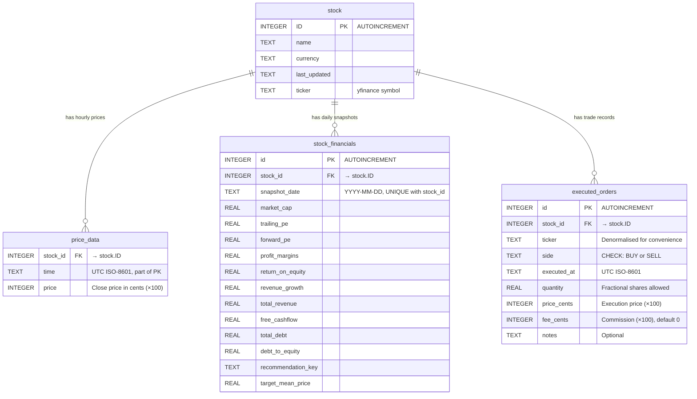
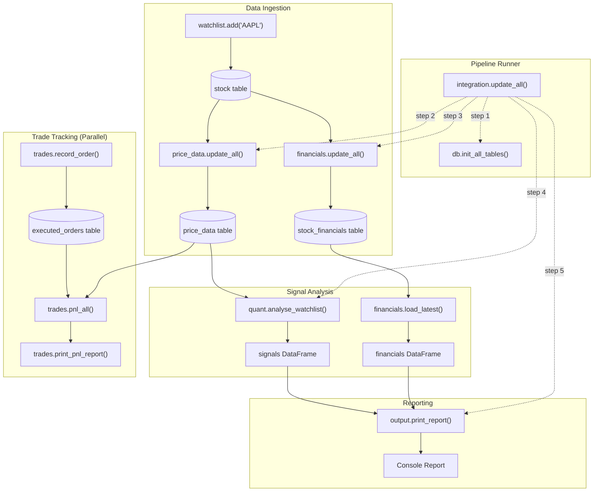
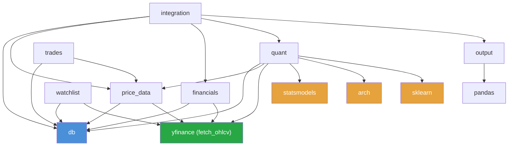

# MacroScope — Technical Documentation

> *A complete technical reference for the MacroScope stock analysis pipeline: database schema, module architecture, data flow, and code walkthroughs.*

---

## Table of Contents

1. [Technology Stack & Dependencies](#1-technology-stack--dependencies)
2. [Directory Layout](#2-directory-layout)
3. [Database Schema](#3-database-schema)
   - 3.1 [Entity-Relationship Diagram](#31-entity-relationship-diagram)
   - 3.2 [Table Definitions](#32-table-definitions)
4. [Pipeline Architecture](#4-pipeline-architecture)
   - 4.1 [Data Flow Diagram](#41-data-flow-diagram)
   - 4.2 [Module Dependency Graph](#42-module-dependency-graph)
5. [Module Walkthroughs](#5-module-walkthroughs)
   - 5.1 [db.py — Database Layer](#51-dbpy--database-layer)
   - 5.2 [watchlist.py — Stock Management](#52-watchlistpy--stock-management)
   - 5.3 [price_data.py — Hourly Price Ingestion](#53-price_datapy--hourly-price-ingestion)
   - 5.4 [financials.py — Fundamental Data Snapshots](#54-financialspy--fundamental-data-snapshots)
   - 5.5 [quant.py — Signal Algorithms](#55-quantpy--signal-algorithms)
   - 5.6 [output.py — Console Report Formatter](#56-outputpy--console-report-formatter)
   - 5.7 [trades.py — Order Ledger & FIFO P&L](#57-tradespy--order-ledger--fifo-pl)
   - 5.8 [integration.py — Pipeline Orchestrator](#58-integrationpy--pipeline-orchestrator)
6. [Data Conventions & Design Decisions](#6-data-conventions--design-decisions)
7. [Extending the System](#7-extending-the-system)

---

## 1. Technology Stack & Dependencies

| Component | Technology | Version Constraint |
|-----------|-----------|-------------------|
| Language | Python | 3.14 (`.venv`) |
| Database | SQLite | Standard library |
| Market Data | yfinance | (via `Ticker.history()` and `.info`) |
| Data Processing | pandas, numpy | pandas ≥ 2.0.0 |
| Statistical Models | statsmodels | ≥ 0.14.0 |
| Volatility Models | arch | ≥ 7.0.0 |
| Machine Learning | scikit-learn | ≥ 1.4.0 |
| Visualization (legacy) | Plotly, Streamlit | ≥ 5.18.0, ≥ 1.35.0 |
| FRED API (legacy) | fredapi | ≥ 0.5.2 |

**`requirements.txt`:**
```
streamlit>=1.35.0
fredapi>=0.5.2
pandas>=2.0.0
plotly>=5.18.0
python-dotenv>=1.0.0
scikit-learn>=1.4.0
statsmodels>=0.14.0
arch>=7.0.0
```

> **Note**: `streamlit`, `fredapi`, `plotly`, and `python-dotenv` are legacy dependencies from the FRED dashboard era. They are not required by the current yfinance pipeline but remain in `requirements.txt`. The yfinance package itself is not listed but is installed in the virtual environment.

---

## 2. Directory Layout

```
FredProject/
├── macroscope.db              ← SQLite database (all persistent state)
├── yfin.ipynb                 ← Jupyter notebook for prototyping
├── fred.ipynb                 ← Legacy FRED exploration notebook
├── quantitative-trading-algorithms-spec.md  ← Algorithm spec document
├── macroscope_design.json     ← Original FRED dashboard design doc
├── macEx.py                   ← Standalone example/utility script
├── pyproject.toml             ← PEP 518 build configuration
├── requirements.txt           ← Python dependencies
├── .env                       ← Environment variables (FRED_API_KEY)
├── .gitignore
│
├── docs/
│   ├── THEORETICAL.md         ← Conceptual & algorithmic documentation
│   └── TECHNICAL.md           ← This file
│
├── data/                      ← Reserved for future CSV/HTML exports
│
├── assets/                    ← UI assets (legacy)
│
├── src/                       ← Active source code
│   ├── db.py                  ← Shared database connection & schema
│   ├── watchlist.py           ← Add/remove/list watchlist stocks
│   ├── price_data.py          ← Hourly price download & storage
│   ├── financials.py          ← .info fundamental snapshots
│   ├── quant.py               ← EMA/RSI signals + 6 algorithm classes
│   ├── output.py              ← Console report formatting
│   ├── trades.py              ← Executed orders ledger & FIFO P&L
│   ├── integration.py         ← Pipeline orchestrator
│   └── _old/                  ← Archived FRED/Streamlit modules
│       ├── app.py             ← Streamlit UI controller
│       ├── charts.py          ← Plotly visualization
│       ├── data_fetcher.py    ← FRED API wrapper
│       └── database.py        ← Legacy SQLite layer
│
├── tests/                     ← Unit tests (legacy)
│   ├── __init__.py
│   ├── test_database.py
│   └── test_data_fetcher.py
│
└── .agents/                   ← AI agent configuration
    └── skills/
        ├── macroscope-project/
        └── yfinance-pipeline/
```

---

## 3. Database Schema

All data is stored in a single SQLite file: `macroscope.db` at the project root.

### 3.1 Entity-Relationship Diagram



> **Note**: The `stock_financials` table has 53 data columns (shown abbreviated above). See [Table Definitions](#32-table-definitions) for the full column list.

### 3.2 Table Definitions

#### `stock` — Watchlist

The central entity. Every other table references `stock.ID`.

| Column | Type | Constraints | Description |
|--------|------|-------------|-------------|
| `ID` | INTEGER | PRIMARY KEY AUTOINCREMENT | Auto-assigned unique identifier |
| `name` | TEXT | — | Company long name (auto-fetched from yfinance `.info`) |
| `currency` | TEXT | — | Trading currency (default: `USD`) |
| `last_updated` | TEXT | — | UTC ISO-8601 timestamp of last price data update |
| `ticker` | TEXT | — | yfinance symbol, e.g. `"AAPL"` (added via migration) |

> The `ticker` column was added after initial table creation via an `ALTER TABLE` migration in `db.init_all_tables()`.

#### `price_data` — Hourly Close Prices

| Column | Type | Constraints | Description |
|--------|------|-------------|-------------|
| `stock_id` | INTEGER | NOT NULL, FK → `stock.ID` | Which stock this price belongs to |
| `time` | TEXT | NOT NULL | UTC ISO-8601 timestamp of the candle |
| `price` | INTEGER | NOT NULL | Close price in **integer cents** (×100) |

**Primary Key**: Composite `(stock_id, time)` — prevents duplicate rows for the same stock at the same timestamp.

**Why integer cents?** Floating-point arithmetic introduces precision drift over thousands of calculations. Storing as integer cents (`$150.25` → `15025`) eliminates this entirely. Divide by 100 to recover the real price.

**Deduplication strategy**: The composite PK combined with `INSERT OR IGNORE` ensures that re-fetching overlapping data never creates duplicates.

#### `stock_financials` — Fundamental Snapshots

One row per stock per day, capturing 53 fields from yfinance's `.info` dictionary.

| Column | Type | Category | yfinance Key |
|--------|------|----------|-------------|
| `id` | INTEGER PK | — | — |
| `stock_id` | INTEGER FK | — | — |
| `snapshot_date` | TEXT | — | — |
| `market_cap` | REAL | Valuation | `marketCap` |
| `enterprise_value` | REAL | Valuation | `enterpriseValue` |
| `trailing_pe` | REAL | Valuation | `trailingPE` |
| `forward_pe` | REAL | Valuation | `forwardPE` |
| `peg_ratio` | REAL | Valuation | `pegRatio` |
| `price_to_book` | REAL | Valuation | `priceToBook` |
| `price_to_sales_ttm` | REAL | Valuation | `priceToSalesTrailing12Months` |
| `ev_to_revenue` | REAL | Valuation | `enterpriseToRevenue` |
| `ev_to_ebitda` | REAL | Valuation | `enterpriseToEbitda` |
| `profit_margins` | REAL | Profitability | `profitMargins` |
| `gross_margins` | REAL | Profitability | `grossMargins` |
| `ebitda_margins` | REAL | Profitability | `ebitdaMargins` |
| `operating_margins` | REAL | Profitability | `operatingMargins` |
| `return_on_assets` | REAL | Profitability | `returnOnAssets` |
| `return_on_equity` | REAL | Profitability | `returnOnEquity` |
| `earnings_growth` | REAL | Growth | `earningsGrowth` |
| `revenue_growth` | REAL | Growth | `revenueGrowth` |
| `earnings_quarterly_growth` | REAL | Growth | `earningsQuarterlyGrowth` |
| `total_revenue` | REAL | Income/Cash | `totalRevenue` |
| `gross_profits` | REAL | Income/Cash | `grossProfits` |
| `ebitda` | REAL | Income/Cash | `ebitda` |
| `net_income` | REAL | Income/Cash | `netIncomeToCommon` |
| `free_cashflow` | REAL | Income/Cash | `freeCashflow` |
| `operating_cashflow` | REAL | Income/Cash | `operatingCashflow` |
| `total_cash` | REAL | Balance Sheet | `totalCash` |
| `total_cash_per_share` | REAL | Balance Sheet | `totalCashPerShare` |
| `total_debt` | REAL | Balance Sheet | `totalDebt` |
| `debt_to_equity` | REAL | Balance Sheet | `debtToEquity` |
| `quick_ratio` | REAL | Balance Sheet | `quickRatio` |
| `current_ratio` | REAL | Balance Sheet | `currentRatio` |
| `trailing_eps` | REAL | Per-Share | `trailingEps` |
| `forward_eps` | REAL | Per-Share | `forwardEps` |
| `book_value` | REAL | Per-Share | `bookValue` |
| `revenue_per_share` | REAL | Per-Share | `revenuePerShare` |
| `dividend_rate` | REAL | Dividends | `dividendRate` |
| `dividend_yield` | REAL | Dividends | `dividendYield` |
| `payout_ratio` | REAL | Dividends | `payoutRatio` |
| `five_year_avg_div_yield` | REAL | Dividends | `fiveYearAvgDividendYield` |
| `beta` | REAL | Risk/Market | `beta` |
| `fifty_two_week_high` | REAL | Risk/Market | `fiftyTwoWeekHigh` |
| `fifty_two_week_low` | REAL | Risk/Market | `fiftyTwoWeekLow` |
| `shares_outstanding` | REAL | Risk/Market | `sharesOutstanding` |
| `float_shares` | REAL | Risk/Market | `floatShares` |
| `shares_short` | REAL | Risk/Market | `sharesShort` |
| `short_ratio` | REAL | Risk/Market | `shortRatio` |
| `short_percent_of_float` | REAL | Risk/Market | `shortPercentOfFloat` |
| `target_high_price` | REAL | Analyst | `targetHighPrice` |
| `target_low_price` | REAL | Analyst | `targetLowPrice` |
| `target_mean_price` | REAL | Analyst | `targetMeanPrice` |
| `target_median_price` | REAL | Analyst | `targetMedianPrice` |
| `recommendation_key` | TEXT | Analyst | `recommendationKey` |
| `recommendation_mean` | REAL | Analyst | `recommendationMean` |
| `num_analyst_opinions` | INTEGER | Analyst | `numberOfAnalystOpinions` |

**Uniqueness**: `UNIQUE(stock_id, snapshot_date)` — one snapshot per stock per day. Safe to re-run.

#### `executed_orders` — Trade Ledger

| Column | Type | Constraints | Description |
|--------|------|-------------|-------------|
| `id` | INTEGER | PRIMARY KEY AUTOINCREMENT | Unique order identifier |
| `stock_id` | INTEGER | NOT NULL, FK → `stock.ID` | Which stock was traded |
| `ticker` | TEXT | NOT NULL | Denormalised ticker symbol |
| `side` | TEXT | NOT NULL, CHECK(`BUY`/`SELL`) | Trade direction |
| `executed_at` | TEXT | NOT NULL | UTC ISO-8601 execution timestamp |
| `quantity` | REAL | NOT NULL | Number of shares (fractional allowed) |
| `price_cents` | INTEGER | NOT NULL | Execution price in integer cents (×100) |
| `fee_cents` | INTEGER | NOT NULL, DEFAULT 0 | Commission in integer cents |
| `notes` | TEXT | — | Optional free-text comment |

> **No UNIQUE constraint** on `(stock_id, executed_at)` — the same ticker can be traded multiple times at the same timestamp.

---

## 4. Pipeline Architecture

### 4.1 Data Flow Diagram



### 4.2 Module Dependency Graph



**Legend**: 🔵 Internal modules | 🟢 Data source | 🟡 External libraries

---

## 5. Module Walkthroughs

### 5.1 `db.py` — Database Layer

**Purpose**: Centralised database access. Every module imports `db` to get connections — no module opens `sqlite3.connect()` directly.

**Key behaviours**:
- `get_conn()` returns a `sqlite3.Connection` with foreign key enforcement always enabled (`PRAGMA foreign_keys = ON`)
- `init_all_tables()` creates all four tables using `CREATE TABLE IF NOT EXISTS` — fully idempotent
- Includes a migration for the `ticker` column on the `stock` table (checks `PRAGMA table_info`, adds via `ALTER TABLE` if missing)
- DB file path is resolved relative to the project root: `os.path.dirname(src/) → project root → macroscope.db`

```python
# Example: getting a connection
import db
conn = db.get_conn()
# ... use conn ...
conn.close()

# Example: ensuring schema is current
db.init_all_tables()
```

---

### 5.2 `watchlist.py` — Stock Management

**Purpose**: CRUD operations for the stock watchlist.

**`add(ticker, name=None, currency='USD')`**:
- Upper-cases and strips the ticker
- Checks for duplicate tickers before inserting
- Auto-fetches the company name and currency from yfinance `.info` if not provided
- Silently skips if the ticker already exists

```python
import watchlist
watchlist.add("TSLA")           # Auto-fetches name from yfinance
watchlist.add("BTC-USD", name="Bitcoin", currency="USD")
```

**`remove(ticker)`**:
- **Cascading delete**: removes the stock AND all its `price_data` and `stock_financials` rows
- Does NOT currently delete `executed_orders` — this is worth noting as a potential inconsistency

> ⚠️ **Noted inconsistency**: `watchlist.remove()` cascades deletes to `price_data` and `stock_financials` but does NOT clean up `executed_orders`. If a ticker is removed and re-added, orphaned orders from the old `stock_id` could cause foreign key issues.

**`get_all()`**: Returns a DataFrame with columns `ID, ticker, name, currency, last_updated`.

---

### 5.3 `price_data.py` — Hourly Price Ingestion

**Purpose**: Download and store hourly close prices from yfinance.

**Incremental fetching strategy**:
1. Check `MAX(time)` in `price_data` for the given stock
2. If no data exists: full download using `period="730d"` (yfinance's maximum hourly window)
3. If data exists: fetch from the last stored date onwards using `start=<date>`
4. Double-deduplication:
   - **Application layer**: Skip rows where `ts_str <= last_time`
   - **Database layer**: `INSERT OR IGNORE` respects the composite PK `(stock_id, time)`

**Price storage**: Close prices are converted to integer cents via `int(round(close * 100))` before storage.

**Timezone handling**: All timestamps from yfinance are converted to UTC via `pd.DatetimeIndex(hist.index).tz_convert("UTC")` and stored as ISO-8601 strings.

```python
import price_data

# Update all watchlist stocks
price_data.update_all()

# Load stored prices for analysis
df = price_data.load("AAPL")  # Returns DataFrame: index=datetime(UTC), col='close'(float $)
```

**`load(ticker)`**: Reads from DB, converts cents back to dollars (`price / 100.0`), sets a UTC-aware DatetimeIndex.

---

### 5.4 `financials.py` — Fundamental Data Snapshots

**Purpose**: Download and store daily snapshots of 53 fundamental metrics from yfinance's `.info` dictionary.

**`INFO_FIELD_MAP`**: A dictionary mapping 53 database column names to yfinance `.info` keys. This is the single source of truth for which fields are tracked.

**Incremental strategy**: One snapshot per stock per day. `save_snapshot()` checks `UNIQUE(stock_id, snapshot_date)` before fetching data — if today's snapshot exists, the network call is skipped entirely.

**Data quality**: All numeric fields are explicitly cast to `float` with a try/except guard. yfinance returns a mix of `int`, `float`, and `None` values depending on the ticker and market, so defensive casting is essential.

```python
import financials

# Fetch today's fundamentals for all watchlist stocks
financials.update_all()

# Load the most recent snapshot (pivoted: rows=metrics, columns=tickers)
latest = financials.load_latest()
print(latest["AAPL"]["trailing_pe"])

# Load all snapshots for one stock (indexed by date)
history = financials.load_history("NVDA")
```

**`load_latest()`**: Uses a correlated subquery to find the MAX snapshot_date per stock_id, then pivots the result so rows are metric names and columns are ticker symbols. This format is optimised for side-by-side comparison.

---

### 5.5 `quant.py` — Signal Algorithms

**Purpose**: The analytical engine. Contains both the legacy pipeline signal and six advanced algorithm classes.

This module has two distinct sections:

#### Legacy Public API (pipeline-integrated)

These functions are called by `integration.py` and `output.py`:

- **`compute_ema(series, span)`** — Standard EMA using pandas `ewm(adjust=False)`
- **`compute_rsi(series, period=14)`** — Wilder's RSI via exponential smoothing
- **`generate_signal(close)`** — Composite EMA(20)/EMA(50) + RSI(14) signal
- **`analyse_watchlist()`** — Runs `generate_signal()` for every stock in the watchlist, loading prices via `price_data.load()`

```python
import quant

# Run signals for the entire watchlist
signals_df = quant.analyse_watchlist()
# Returns DataFrame: ticker, name, signal, last_close, ema_fast, ema_slow, rsi, trend
```

#### Advanced Algorithm Classes (standalone toolkit)

Each class follows the same interface: instantiate with parameters, call `.run()` with price data.

```python
import quant, price_data

# Dual EMA Crossover
closes = price_data.load("AAPL")["close"]
ema_algo = quant.DualEMACrossover(short_period=12, long_period=26)
result = ema_algo.run(closes)
# result["signal"] → numpy array of +1/-1/0

# Donchian Breakout (needs OHLC data)
ohlcv = quant.fetch_ohlcv("AAPL")
donchian = quant.DonchianBreakout(entry_period=20, exit_period=10)
result = donchian.run(ohlcv["High"], ohlcv["Low"], ohlcv["Close"])

# Pairs Trading
prices_a = price_data.load("GOOGL")["close"]
prices_b = price_data.load("MSFT")["close"]
pairs = quant.PairsTradingZScore(estimation_window=250, z_window=30)
result = pairs.run(prices_a, prices_b)
# result["adf_pvalue"] → check stationarity before trusting signals

# Bollinger Bands
bb = quant.BollingerBands(period=20, num_std=2.0)
result = bb.run(closes)

# ARIMA-GARCH (needs 501+ bars)
arima = quant.ARIMAGARCHModel(fit_window=500, risk_aversion=1.0)
result = arima.run(closes)
# result["converged"] → True if MLE succeeded, False if fallback was used

# Random Forest (needs 1025+ bars of OHLCV)
rf = quant.RandomForestSignal(n_trees=500, forecast_horizon=5)
result = rf.run(ohlcv)
# result["probability_up"] → 0.0 to 1.0
```

**`fetch_ohlcv(ticker)`**: A convenience helper that downloads OHLCV data from yfinance for algorithms that need more than just close prices. This data is NOT persisted to the DB — it is ephemeral, downloaded each time it's called.

---

### 5.6 `output.py` — Console Report Formatter

**Purpose**: Renders a formatted text-based signal report to the console.

**`print_report(signals_df, financials_df=None)`**:
- Accepts the output of `quant.analyse_watchlist()` and optionally `financials.load_latest()`
- Displays per-stock: signal label, last close, EMA values, RSI, trend
- If fundamentals are provided, appends key metrics: P/E (trailing & forward), net margin, ROE, revenue growth, D/E ratio, analyst recommendation, and target price
- Uses emoji-style labels: `BUY [+]`, `SELL [-]`, `HOLD [~]`

**Key financial metrics displayed** (when fundamentals are available):

| Metric | DB Column | Format |
|--------|-----------|--------|
| P/E (TTM) | `trailing_pe` | Numeric |
| P/E (Fwd) | `forward_pe` | Numeric |
| Net Margin | `profit_margins` | Percentage |
| ROE | `return_on_equity` | Percentage |
| Rev Growth | `revenue_growth` | Percentage |
| D/E Ratio | `debt_to_equity` | Numeric |
| Analyst | `recommendation_key` | Text (e.g., "buy", "hold") |
| Target $ | `target_mean_price` | Dollar |

---

### 5.7 `trades.py` — Order Ledger & FIFO P&L

**Purpose**: Records executed buy/sell orders and computes portfolio P&L using FIFO matching.

**`record_order(ticker, side, quantity, price, ...)`**:
- Validates inputs (side must be BUY/SELL, quantity > 0, price ≥ 0)
- Resolves `stock_id` from the watchlist — raises `ValueError` if the ticker isn't in the watchlist
- Converts price and fee to integer cents before storage
- Defaults `executed_at` to current UTC time if not provided

```python
import trades

# Record a buy order
trades.record_order("AAPL", "BUY", quantity=10, price=150.00, fee=1.00)

# Record a sell order
trades.record_order("AAPL", "SELL", quantity=5, price=170.00, fee=0.50,
                    notes="Partial profit-taking")

# View all orders for a ticker
df = trades.load("AAPL")

# FIFO P&L per ticker
summary = trades.pnl_by_ticker()

# Full portfolio P&L with mark-to-market
full = trades.pnl_all(use_live_prices=True)

# Formatted console report
trades.print_pnl_report()
```

**FIFO Engine** (`_fifo_pnl`):
- Maintains a list of open BUY lots (each with `qty` and `cost_per_share`)
- When a SELL is encountered, matches against the oldest lots first
- Cost per share includes buy-side fees; proceeds per share deducts sell-side fees
- Warns if a SELL exceeds known open lots (short selling not modelled)
- Returns: `realised_pnl`, `open_lots`, `total_open_qty`, `avg_cost`, `total_fees`

**`pnl_all(use_live_prices=True)`**:
- Extends `pnl_by_ticker()` with mark-to-market data
- Reads the most recent close price from `price_data.load(ticker)` for each stock
- Calculates: `market_value`, `unrealised_pnl`, `total_pnl`
- If `use_live_prices=False`, unrealised columns are set to NaN

---

### 5.8 `integration.py` — Pipeline Orchestrator

**Purpose**: Chains all pipeline steps in the correct order. This is the main entry point for running the full analysis.

**`update_all(skip_prices=False, skip_financials=False)`**:

| Step | Module Call | Skippable? |
|------|-----------|------------|
| 1/5 | `db.init_all_tables()` | No |
| 2/5 | `price_data.update_all()` | Yes (`skip_prices=True`) |
| 3/5 | `financials.update_all()` | Yes (`skip_financials=True`) |
| 4/5 | `quant.analyse_watchlist()` | No |
| 5/5 | `output.print_report(signals, financials)` | No |

**Running the pipeline:**
```bash
# From the project root
.venv/bin/python src/integration.py

# Or from Python/notebook
import sys; sys.path.insert(0, "src")
import integration
integration.update_all()
integration.update_all(skip_prices=True)  # Signals only (no network)
```

**Path handling**: The module adds `src/` to `sys.path` at import time via `os.path.dirname(os.path.abspath(__file__))`, ensuring all sibling modules are importable regardless of the working directory.

---

## 6. Data Conventions & Design Decisions

| Decision | Choice | Rationale |
|----------|--------|-----------|
| **Price storage** | Integer cents (`price × 100`) | Avoids floating-point precision drift. `$150.25` → `15025`. All public-facing functions convert back to dollars. |
| **Timestamps** | UTC ISO-8601 strings in TEXT columns | Universal, human-readable, sortable. yfinance returns timezone-aware datetimes which are normalised to UTC before storage. |
| **Incremental updates** | Fetch from `MAX(time)` date onwards | Avoids re-downloading entire history. Combined with `INSERT OR IGNORE` for overlap safety. |
| **Financials cadence** | One snapshot per stock per day | `UNIQUE(stock_id, snapshot_date)` prevents duplicates. Safe to re-run multiple times. |
| **Database** | Single SQLite file | Zero configuration, no server process, file-based portability. Adequate for single-user analytical workloads. |
| **FK enforcement** | Always on via `PRAGMA foreign_keys = ON` | Prevents orphaned rows and ensures referential integrity. |
| **Shared DB layer** | Centralised `db.py` | Single connection factory ensures consistent FK enforcement and path resolution. Old `database.py` left untouched. |
| **Module imports** | `sys.path.insert(0, src/)` pattern | Allows running from any working directory. Notebook setup cell uses the same pattern. |
| **yfinance method** | `Ticker.history()` over `yf.download()` | `download()` returns multi-level column headers for multiple tickers. `history()` returns a flat DataFrame — simpler for single-ticker pipelines. |
| **Hourly data window** | 730 days maximum | yfinance limitation — hourly data is only available for the last ~2 years. |

---

## 7. Extending the System

### Adding a New Module

1. Create `src/new_module.py`
2. Import `db` (not `database`) for database access
3. Use `db.get_conn()` for connections — never open `sqlite3.connect()` directly
4. If a new table is needed: add `CREATE TABLE IF NOT EXISTS` to `db.init_all_tables()`
5. Follow the existing pattern: `update_all()` for ingestion, `load()` / `load_latest()` for reading
6. Wire into `integration.update_all()` as a new numbered step
7. Export loading functions so `output.py` can consume the data

### Adding a New Financial Field

1. Add the column to the `stock_financials` CREATE TABLE in `db.init_all_tables()`
2. For existing databases: add an `ALTER TABLE` migration (check `PRAGMA table_info` first)
3. Add the mapping to `INFO_FIELD_MAP` in `financials.py`
4. Re-run `financials.update_all()` — new snapshots will include the field

### Adding a New Algorithm

1. Create a class in `quant.py` following the existing pattern:
   - Constructor accepts parameters with sensible defaults
   - `.run()` method accepts price data and returns a dict with `signal` and diagnostic values
   - Input validation with descriptive `ValueError` messages
   - Explicit warmup handling (NaN or 0 for pre-warmup bars)
2. Add a usage example to this documentation
3. To integrate into the pipeline: add to `analyse_watchlist()` or create a signal aggregation layer

### Adding a New yfinance Data Source

1. Explore the data in a notebook: `yf.Ticker("AAPL").quarterly_financials`
2. Add a new table to `db.init_all_tables()`
3. Create a new module following the `financials.py` pattern:
   - `_fetch(ticker)` → raw data
   - `save(stock_id, ticker)` → insert to DB
   - `update_all()` → loop watchlist
   - `load(ticker)` → read from DB
4. Wire into `integration.update_all()`

### Database Inspection Commands

```bash
# List all tables
sqlite3 macroscope.db '.tables'

# Count price rows per stock
sqlite3 macroscope.db \
  'SELECT s.ticker, COUNT(*) FROM stock s JOIN price_data p ON s.ID=p.stock_id GROUP BY s.ticker;'

# Latest financial snapshot dates
sqlite3 macroscope.db \
  'SELECT s.ticker, MAX(f.snapshot_date) FROM stock s JOIN stock_financials f ON s.ID=f.stock_id GROUP BY s.ticker;'

# View all executed orders
sqlite3 macroscope.db 'SELECT * FROM executed_orders ORDER BY executed_at;'

# Check database file size
ls -lh macroscope.db
```

---

*This document covers the technical implementation of MacroScope. For the conceptual foundations, trading theory, and project roadmap, see [THEORETICAL.md](./THEORETICAL.md).*
